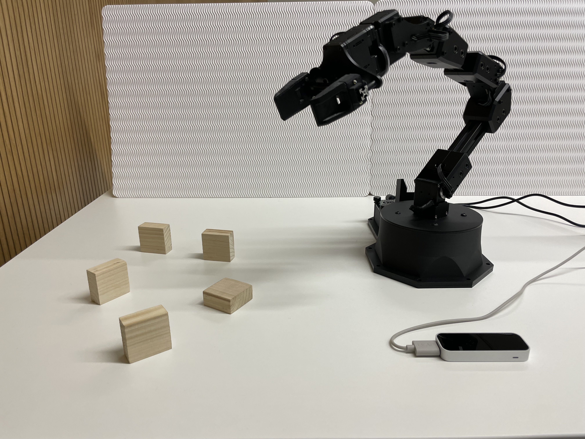

# Human Robot Interaction

## Requierments
You should have [Ubuntu 20.04](https://releases.ubuntu.com/20.04/), [ROS Noetic](http://wiki.ros.org/noetic), [Leap Motion SDK](https://developer.leapmotion.com/tracking-software-download), [Python 2](https://www.python.org/downloads/release/python-272/), and [Python 3](https://www.python.org/downloads/) installed on your device.
## Features

## Documentation and Enviornment setup
The documentation of this repository can be found [here](). This documentation includes a description of the sensors and the robot arm which were used to develop and test the industrial-like interaction.

For more information on how to perfom the correct installation of the requierments mentioned before and the correct environemtal setup please refer to [Chapter 5 subsection 1]() from the documentation.
## Installation
**1.** Go to the source folder of your catkin workspace.
```bash 
cd ~/catkin_ws/src
git clone https://github.com/Jasv06/human_robot_interaction.git
cd ~/catkin_ws
catkin_make
```
**2.** Source your current catkin workspace.
```bash 
source ~/catkin_ws/devel/setup.bash
```
